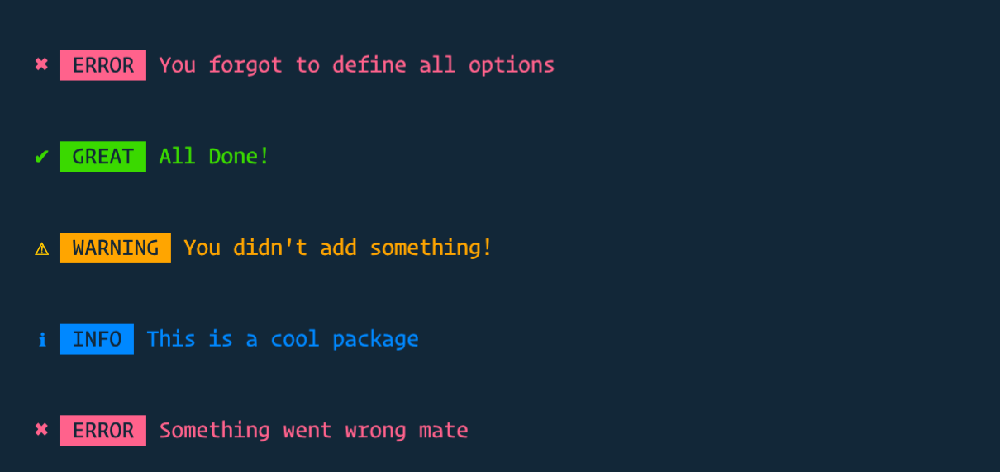

# cli-alerts

[](https://www.npmjs.com/package/node-cli-handle-error) [](https://VSCode.pro/?utm_source=GitHubFOSS)
[](https://twitter.com/tkoriginale/)

> Cross Platform CLI Alerts

<br>

[](./../../)

## Install

```sh
npm install cli-alert
```

<br>

[](./../../)

## Usage

```js
const alert = require('cli-alert')

// You can choose between SUCCESS, INFO, WARNING, ERROR

alert()
// Prints: ✖  ERROR  You forgot to define all options

alert({ type: 'success', msg: 'All Done!', name: 'Great' })
// Prints:  ✔  GREAT  All Done!

alert({ type: 'info', msg: 'This is a cool package' })
// Prints:  ℹ  INFO  This is a cool package

alert({ type: 'warning', msg: "You didn't add something!" })
// Prints:  ⚠  WARNING  You didn't add something!

alert({ type: 'error', msg: 'Something went wrong mate' })
// Prints:  ✖  ERROR  Something went wrong mate
```

<br />

[](./../../)

## API

### alert(options)

#### ❯ options

Type: `object`<br>
Default: {}

#### ❯ type

Type: `string`<br>
Default: `error`

#### ❯ msg

Type: `string`<br>
Default: `You forgot to define all options`

#### ❯ name

Type: `string`<br>
Default: ``

[](changelog.md)

## Changelog

[❯ Read the changelog here →](changelog.md)

<br>

<small>**KEY**: `📦 NEW`, `👌 IMPROVE`, `🐛 FIX`, `📖 DOC`, `🚀 RELEASE`, and `✅ TEST`

> _I use [Emoji-log](https://github.com/ahmadawais/Emoji-Log), you should try it and simplify your git commits._

</small>

<br>

[](./../../)

## License & Conduct

- MIT © [Tauqueer Khan](https://twitter.com/tkoriginale/)
- [Code of Conduct](code-of-conduct.md)

<br>

[](./../../)

- This readme was build using template and icons from Ahmad Awais
